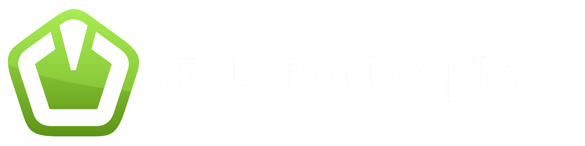

 

  

  <h3 align="center">SFML Boilerplate</h3>

  

    An SFML Boilerplate for my future projects.
     
    <a href="https://github.com/CalcoDev/SFML-Boilerplate">View Demo</a>
    ·
    <a href="https://github.com/CalcoDev/SFML-Boilerplate/issues">Report Bug</a>
  

<!-- ABOUT THE PROJECT -->

## About The Project

[![Product Name Screen Shot][product-screenshot]](https://github.com/CalcoDev/SFML-Boilerplate)

**!!! CURRENTLY THE PROJECT LINKS SFML AND SFML IMGUI-SFML STATICALLY & USING ABSOLUTE PATHS. WILL BE FIXED IN NEXT VERSION !!**  

An SFML Boilerplate to use for my future projects.
I made this with the previous projects and code I kept rewritting, in order to simplify the making of games / applications.

### Built With

- [C++](https://en.wikipedia.org/wiki/C%2B%2B)
- [SFML](https://www.sfml-dev.org/index.php)
- [CMake](https://cmake.org/)
- [Dear ImGui](https://github.com/ocornut/imgui)
- [ImGui SFML](https://github.com/eliasdaler/imgui-sfml)

## License

Distributed under the MIT License. See `LICENSE.txt` for more information.

<!-- CONTACT -->

## Contact

Calcopod - [@Calcopod](https://twitter.com/Calcopod2)

[product-screenshot]: GithubImages/ProductScreenshot.PNG
